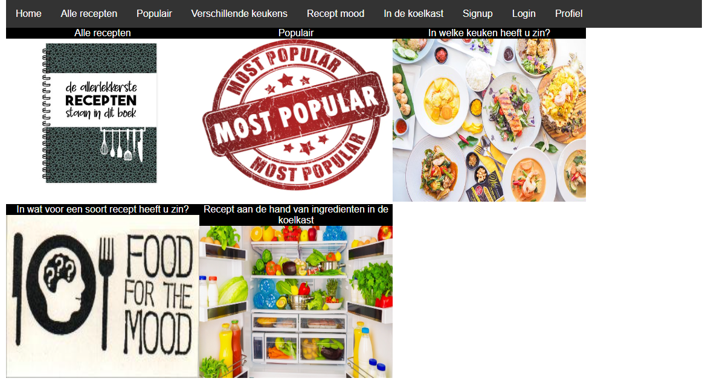

Deze applicatie kan gebruikt worden om te zoeken naar recepten. Er zijn verschillende mogelijkheden om te zoeken naar recepten. 
Deze staan op het home scherm afgebeeld en beschreven. Zo kan er gezocht worden door 
alle recepten, populaire recepten opgehaald worden, maar kan er ook een keuze worden gemaakt tussen de verschillende keukens.
Daarnaast is het ook mogelijk om aan de hand van in wat voor een soort eten je zin hebt een recept op te halen. Ook is het
mogelijk om een recept op te halen op basis van ingredienten die in de koelkast nog liggen.

Om deze applicatie te runnen is niet veel nodig. De api key wordt al meegegeven in de code, dus deze is er al.
De stappen die gedaan dienen te worden zijn:                                                
Op de terminal                                                                  
Type in `npm install`   
Na de installatie typ in `npm start`    
De browser opent automatisch, maar anders typ in http://localhost:3000  
    
Daarnaast is het mogelijk om te registreren en in te loggen         
Om in te loggen kan de volgende username en password gebruikt worden:   
username: receptentest      
password: receptentest  

### `npm start`: wordt gebruikt om de applicatie te starten

### `npm test` : wordt gebruikt om de applicatie te testen

### `npm run build`: wordt gebruikt om de app te bouwen voor productie.

### `npm run eject`: Als deze gebruikt wordt kun je niet meer terug. Deze kan gebruikt worden wanneer je niet tevreden ben met de build tool en de geconfigureerde keuzes. 
